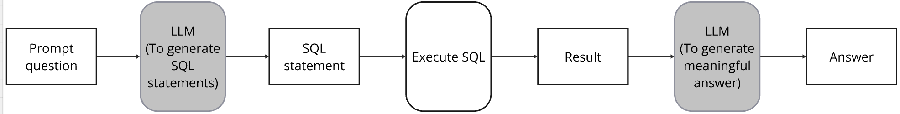
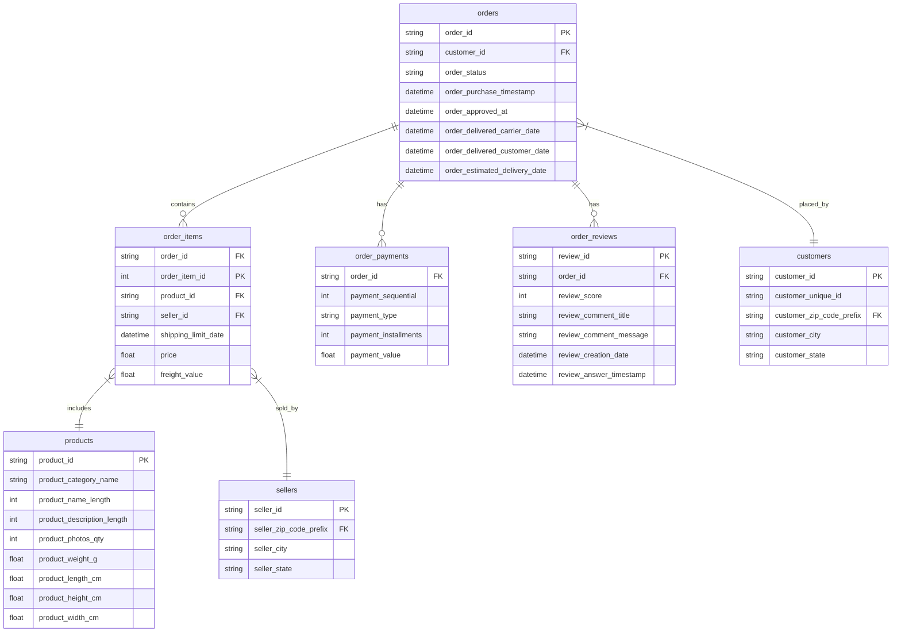

# A Simple LLM-to-SQL Pipeline

Building a basic prompt to sql pipeline, using the database tables given below.

### Model:

### Resources:
You can use either:
- LLM Model: llama-3.3-70b-versatile 
- Groq
- Using Python

### Requirements:
- Setup an account in Groq and create an apikey which can be used to further query the llm model of our choice. In this case llama-3.3-70b-versatile model is used

## Detailed Questions
Some of the questions which are used to test this model:

1. Which seller has delivered the most orders to customers in Rio de Janeiro? [string: seller_id]

2. What's the average review score for products in the 'beleza_saude' category? [float: score]

3. How many sellers have completed orders worth more than 100,000 BRL in total? [integer: count]

4. Which product category has the highest rate of 5-star reviews? [string: category_name]

5. What's the most common payment installment count for orders over 1000 BRL? [integer: installments]

6. Which city has the highest average freight value per order? [string: city_name]

7. What's the most expensive product category based on average price? [string: category_name]

8. Which product category has the shortest average delivery time? [string: category_name]

9. How many orders have items from multiple sellers? [integer: count]

10. What percentage of orders are delivered before the estimated delivery date? [float: percentage]

## Dataset and Schema
For this assignment we will use an open dataset [E-commerce dataset by Olist](https://www.kaggle.com/datasets/terencicp/e-commerce-dataset-by-olist-as-an-sqlite-database/data) from Kaggle.

